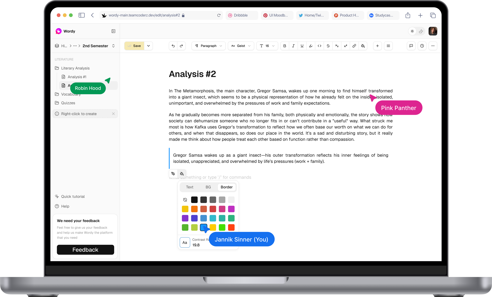

# WordyMe

WordyMe is a centralized platform designed for educational information management. It features a sophisticated rich text editor with support for diagrams, mathematics, and hierarchical document organization, built on a high-performance modern stack.



## Overview

WordyMe is a full-stack application engineered as a monorepo using Turborepo. It combines a modern React web application with a robust Express.js backend to deliver a seamless note-taking and knowledge management experience.

## Key Features

- **Rich Text Editor**: Powered by Lexical, offering a WYSIWYG experience with Markdown support.
- **Advanced Rendering**: Integrated support for Mermaid diagrams and KaTeX math equations.
- **Hierarchical Organization**: Flexible document management with nested spaces and containers.
- **Real-time Collaboration**: WebSocket-based updates for live data synchronization.
- **Enterprise Grade**: Type-safe architecture, authentication, and offline-first PWA capabilities.

## Technology Stack

Our technology stack is chosen for performance, scalability, and developer experience.

- **Frontend**: React 19, Vite, TanStack Router, TanStack Query, Tailwind CSS.
- **Backend**: Express.js, Better Auth, Drizzle ORM, libSQL (SQLite), Socket.io.
- **Infrastructure**: Turborepo, TypeScript, Docker.

## Documentation

Detailed documentation is available in the `docs` directory:

- [**Getting Started**](docs/deployment/LOCAL_SETUP.md): Instructions for local development setup.
- [**Deployment**](docs/deployment/DOCKER.md): Guide for running with Docker and production deployment.
- [**Architecture**](docs/tech/ARCHITECTURE.md): System architecture, monorepo structure, and build system.
- [**Tech Stack**](docs/tech/STACK.md): Detailed breakdown of the technologies used.
- [**Features**](docs/FEATURES.md): Comprehensive list of platform features.

## Quick Start

### Development

To get started with local development:

```bash
git clone https://github.com/WordyMe/WordyMe.git
cd WordyMe
pnpm install
pnpm dev
```

### Production

For a production-ready deployment using Docker:

```bash
docker compose up -d
```

Visit `http://localhost:5173` for the web application and `http://localhost:3000` for the API.

## License

This project is licensed under the Apache-2.0 license. See the [LICENSE](LICENSE) file for details.
